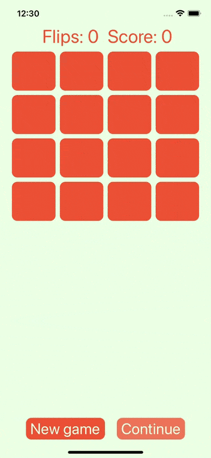
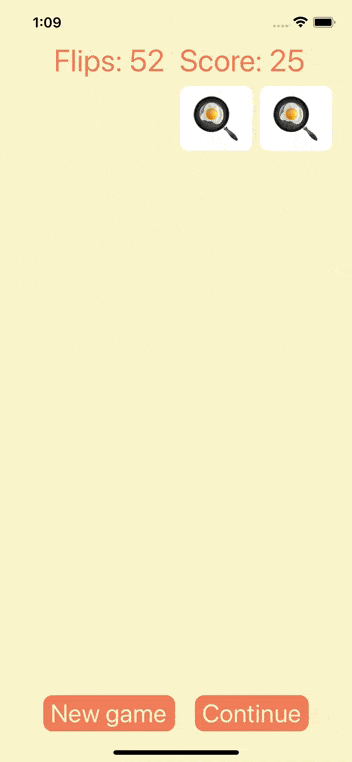
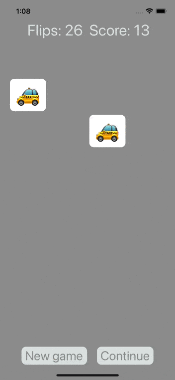

# CONCENTRATION - a simple card game for iOS
A simple but fun game created with Swift.

## Table of Contents
* [Introduction] (#introduction)
* [Requirements] (#requirements)
* [Installation] (#installation)
* [Application Architecture] (#application-architecture)
* [Technologies] (#technologies)
* [Features] (#features)
* [Sources] (#sources)
* [Contacts] (#contacts)

## Introduction
**Concentration** is a card game in which all of the cards are laid face down on a surface and two cards are flipped face up over each turn.  
The *object* of the game is to turn over pairs of matching cards.  
It is a particularly good game for *young children*, though *adults* may find it challenging and stimulating as well.  
  

## Requirements
* Xcode 11.4 or later
* iOS 13.4 or later

## Installation
Add this Swift package in Xcode using its Github repository url (https://github.com/milaplatonova/Concentration):  
File => Swift Packages => Add Package Dependency

## Application Architecture
Concentration App follows the Model-View-Controller (MVC) design pattern and uses such app development practices as Storyboard and Auto Layout.

## Technologies
**Tuples**  
Every theme for the game is represented as a named tuple that contains an array of emojis and 2 colors.  
It is used for updating of theme-dependent view aspects.

**Extensions**  
2 fundamental types are extended in the project:  
 * Int - with the responsible for random choice property
 * UIButton - with the method for customization of button's view  
Due to these extensions it is possible to get the expected result easily just with a single line of code.

## Features
* iPhone and iPad realization
* shuffle cards
* match cards
* flips counting
* scoring system:  
 :point_right: +2 for found matches  
 :point_right: -1 if selected card was flipped before and mismatched
* two options to turn to the next game:  
 __*New game*__ | __*Continue*__
--------------- | ----------------
 with reset of Flips and Score counters | with saving of Flips and Score count
 | 
* random theme (card color, emojis on card, background color, labels and buttons are affected by themes) of 11 possible:  
 :star_struck: faces  
 :ram: animals  
 :hibiscus: plants  
 :cherries: fruits  
  :broccoli: vegetables  
 :hamburger: eat  
 :dress: clothes  
 :taxi: transport  
 :surfing_man: activities  
 :snowman: christmas  
 :jack_o_lantern: halloween  

## Sources
Concentration app is a project made by Paul Hegarty in the lectures 1 and 2 of Stanford's Course "Developing Applications for iOS" (CS193P, Fall 17/18): https://itunes.apple.com/us/course/developing-ios-11-apps-with-swift/id1309275316  
This version of the game includes possible solutions to the assignments (required tasks + extra credit tasks) and some small enhancements.

## Contacts
Lyudmila Platonova  
:email: milaplatonova@icloud.com
